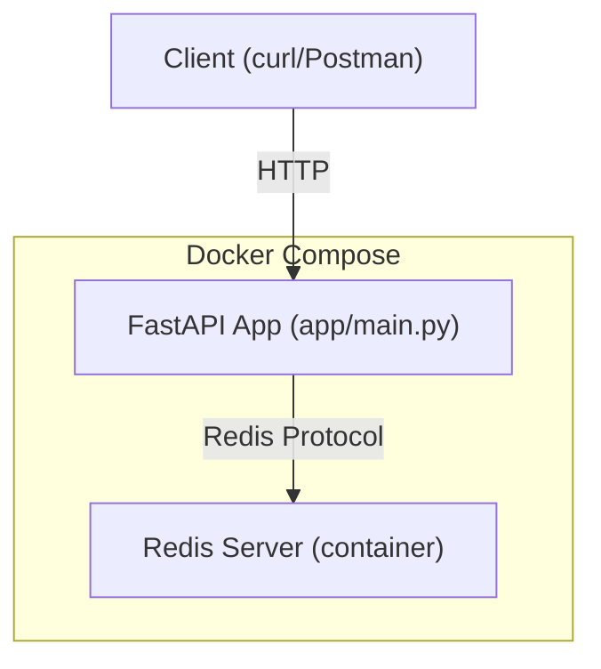

# Documentation: Containerized Redis Cache

## 1. Introduction
A simple, containerized key-value cache microservice using FastAPI and Redis. Exposes REST endpoints for set/get with TTL support. Ideal for learning about microservices, Docker, and caching.

---

## 2. System Architecture

### Overview
- **FastAPI app**: Handles HTTP requests, connects to Redis
- **Redis**: In-memory key-value store
- **Docker Compose**: Orchestrates both containers

### Architecture Diagram



---

## 3. API Reference

### POST /set
- **Description**: Set a key-value pair with optional TTL (seconds)
- **Request Body**:
  ```json
  {
    "key": "string",
    "value": "string",
    "ttl": 60 // optional, integer (seconds)
  }
  ```
- **Response**:
  - 200 OK: `{ "message": "Key 'foo' set successfully." }`
  - 500: Internal server error

### GET /get?key=foo
- **Description**: Get value for a key
- **Response**:
  - 200 OK: `{ "key": "foo", "value": "bar" }`
  - 404: Key not found or expired

---

## 4. Environment & Configuration
- **REDIS_HOST**: Redis hostname (default: `redis` in Docker Compose)
- **REDIS_PORT**: Redis port (default: `6379`)
- Set in `docker-compose.yml` for local development.

---

## 5. Extending the Service
- Add endpoints (e.g., delete, list keys)
- Add authentication or rate limiting
- Add persistent storage for Redis
- Add monitoring/logging

---

## 6. License
MIT 